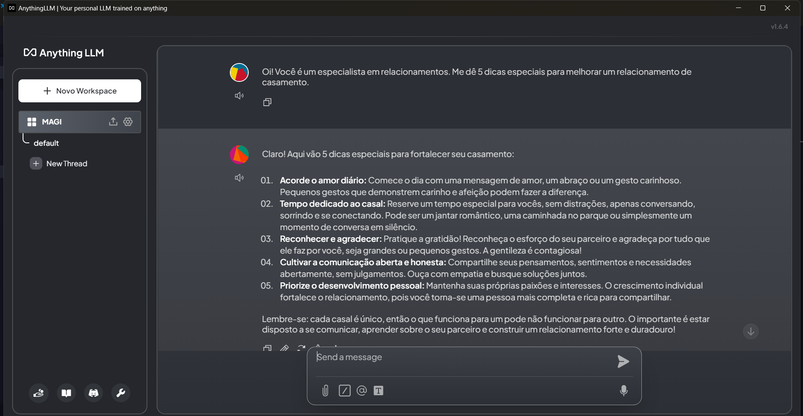
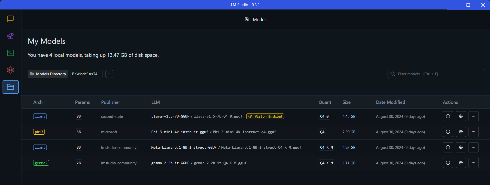
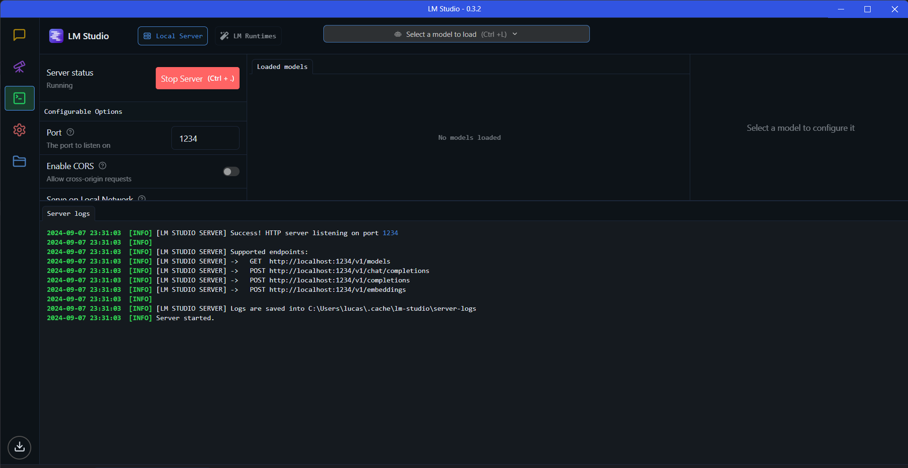

# Aula de instalação e apresentação de ferramentas

- Ferramentas:
  - LM Studio;
  - Anything LLM;
  - Ollama;
  - Modelos de IA;
- Ferramentas instaladas e testes básicos com LM Studio realizado;
- Anything LLM:

- LM Studio:

- Server no LM Studio:
